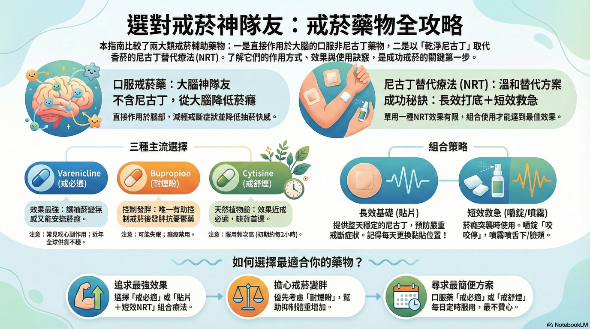

# {{ page.title }}

> 💡 本指南比較了直接作用於大腦的口服藥物，與尼古丁替代療法 (NRT)。

### 2️⃣ 臨床藥師筆記：決策框架摘要

* **追求最強效果**：選 Varenicline (戒必適) 或「貼片+短效NRT」組合療法。
* **擔心戒菸變胖**：優先考慮 Bupropion (耐煙盼)。
* **組合策略**：長效打底 (貼片) + 短效救急 (嚼錠/噴霧)。

---

<a href="https://drive.google.com/file/d/18ORmIQGfAdASBtkctutQUPKR0GZ-WR9T/view?usp=sharing" target="_blank" style="display: inline-block; padding: 10px 20px; background-color: #2c7a7b; color: white; text-decoration: none; border-radius: 5px; margin-top: 10px;">📥 下載完整 PDF 圖卡</a>
